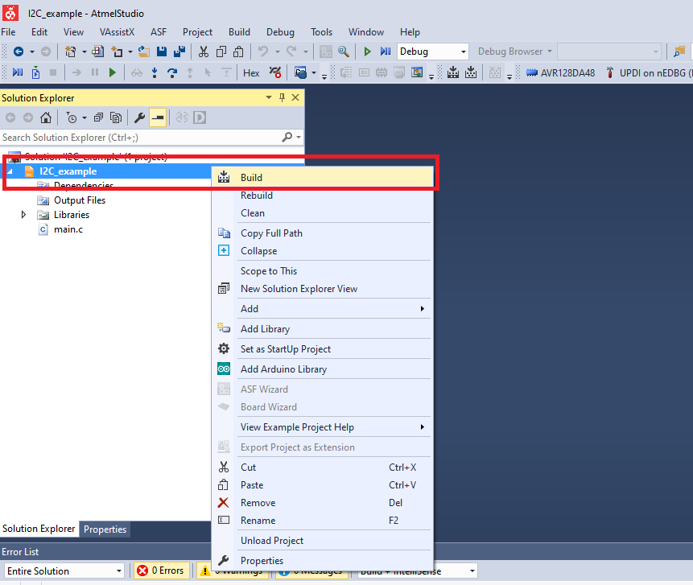

# AVR128DA48 I2C Send Receive Code Example

This repository provides an Atmel Studio solution with a bare metal code example for a basic I2C communication.
This example demonstrates the basic functionality of the TWI peripheral with a basic I2C communication.
The device is connected to a digital potentiometer which communicates through an I2C interface. The device sends read commands to the I2C address of the potentiometer. Two read operations are required every iteration since the potentiometer has a 12 bit resolution.

## Related Documentation
More details and code examples on the AVR128DA48 can be found at the following links:
- [AVR128DA48 Product Page](https://www.microchip.com/wwwproducts/en/AVR128DA28)
- [AVR128DA48 Code Examples on GitHub](https://github.com/microchip-pic-avr-examples?q=avr128da48)
- [AVR128DA48 Project Examples in START](https://start.atmel.com/#examples/AVR128DA48CuriosityNano)

## Software Used
- Atmel Studio 7.0.2397 or newer [(microchip.com/mplab/avr-support/atmel-studio-7)](https://www.microchip.com/mplab/avr-support/atmel-studio-7)
- AVR-Dx 1.0.18 or newer Device Pack

## Hardware Used
- AVR128DA48 Curiosity Nano [(DM164151)](https://www.microchip.com/Developmenttools/ProductDetails/DM164151)

## Setup
The AVR128DA48 Curiosity Nano Development Board is used as test platform
 

The following configurations must be made for this project:

TWI0:
  - Configured in Master mode
  - Baud rate 100000
  - Using default pins (PA2 - SDA, PA3 - SCL)
  - Idle bus state
  - Enable

## Operation

1. Open the *I2C_example.atsln* solution in Atmel Studio

2. Build the solution: right click on *I2C_example* solution and select Build
 

3. Select the AVR128DA48 Curiosity Nano on-board debugger in the *Tool* section of the project settings:
- Right click on the project and click *Properties*;
- Click *Tool* tab on the left panel, select the corresponding debugger and save the configuration (Ctrl + S)
 

4. Program the project to the board: select *I2C_example* project and click *Start Without Debugging*:
 

## Summary

This example represents a basic functionality of the TWI peripheral for a basic I2C communication.
The device reads the value from a digital potentiometer which communicates through an I2C interface.
